### 데이터 분석 AI 챗봇-DAIC (Data Analysis AI Chatbot)

## 📊 프로젝트 소개

DAIC 은 자연어 처리와 RAG(Retrieval Augmented Generation) 기술을 활용하여 사용자의 데이터를 분석하고 시각화하는 지능형 플랫폼입니다. 사용자는 XML 파일을 업로드하고 자연어로 질문하면 AI가 데이터를 분석하여 인사이트를 제공하고 적절한 시각화를 생성합니다.
단방향 LLM 대화로 인한 학습 속도의 저하가 있던 기존의 DataVision 프로젝트에서, DB Storage를 RAG 기술을 활용하여 적절한 Fine-tuning 과 Context Chunk 를 이용하여 해결하는 것이 목표입니다.

TO-BE FLOWCHART

```mermaid
graph TD
    A[사용자] -->|데이터 업로드| B[데이터 저장소]
    A -->|질문 입력| C[AI 챗봇]
    B -->|데이터 제공| D[RAG 시스템]
    C -->|질의| D
    D -->|컨텍스트 + 질문| E[LLM]
    E -->|응답| C
    E -->|시각화 데이터| F[차트 생성기]
    F -->|시각화| C
    C -->|결과 표시| A
```

## ✨ 주요 기능

- **자연어 데이터 분석**: 복잡한 쿼리 언어 없이 한국어로 데이터 분석 요청
- **RAG 기반 정확한 응답**: 사용자 데이터에서 관련 정보를 검색하여 정확한 응답 생성
- **자동 데이터 시각화**: 질문에 적합한 차트 유형을 자동으로 선택하고 생성
- **다양한 파일 형식 지원**: XML 파일 지원 (향후 CSV, JSON 등 확장 예정)
- **대화형 인터페이스**: 사용자 친화적인 채팅 인터페이스로 쉬운 상호작용
- **데이터 저장 및 관리**: 업로드된 파일의 효율적인 관리 및 조직화

## 시스템 아키텍처

### 데이터 처리 파이프라인

```mermaid
flowchart LR
    A[파일 업로드] --> B[파일 저장]
    B --> C[텍스트 추출]
    C --> D[청킹]
    D --> E[임베딩 생성]
    E --> F[벡터 DB 저장]
    
    style A fill:#d0f0c0,stroke:#333,stroke-width:2px,color:#000
    style B fill:#d0f0c0,stroke:#333,stroke-width:2px,color:#000
    style C fill:#f0e68c,stroke:#333,stroke-width:2px,color:#000
    style D fill:#f0e68c,stroke:#333,stroke-width:2px,color:#000
    style E fill:#add8e6,stroke:#333,stroke-width:2px,color:#000
    style F fill:#add8e6,stroke:#333,stroke-width:2px,color:#000
```



### 질의응답 프로세스

```mermaid
sequenceDiagram
    participant U as 사용자
    participant C as 챗봇 UI
    participant R as RAG 엔진
    participant V as 벡터 DB
    participant L as LLM
    participant VIZ as 시각화 엔진
    
    U->>C: 질문 입력
    C->>R: 질문 전달
    R->>V: 관련 데이터 검색
    V-->>R: 관련 컨텍스트 반환
    R->>L: 질문 + 컨텍스트 전송
    L-->>R: 응답 생성
    R->>VIZ: 시각화 데이터 추출
    VIZ-->>C: 차트 렌더링
    C-->>U: 응답 + 시각화 표시
```



## 🛠️ 기술 스택

- **프론트엔드**: Next.js, React, Tailwind CSS, shadcn/ui
- **백엔드**: Next.js API Routes, Node.js
- **데이터베이스**: PostgreSQL + pgvector
- **ORM**: Prisma
- **AI/ML**: AI SDK, OpenAI API, vector embedding
- **시각화**: Recharts
- **인프라**: Vercel (Deployment)


## 🚀 설치 및 설정

### 사전 요구사항

- Node.js 18.x 이상
- PostgreSQL 14.x 이상 (pgvector 확장 포함)
- OpenAI API 키

### 설치 단계

```ruby
# 저장소 클론
git clone https://github.com/gnb1202/DAIC.git
cd DAIC

# 의존성 설치
npm install

# 환경 변수 설정
cp .env.example .env.local
# .env.local 파일에 필요한 API 키와 데이터베이스 URL 입력

# 데이터베이스 마이그레이션
npx prisma migrate dev

# 개발 서버 실행
npm run dev
```

### 📋 프로젝트 구조
```ruby
/
├── src/
│   ├── app/                  # Next.js 앱 라우터
│   ├── components/           # React 컴포넌트
│   ├── lib/                  # 유틸리티 및 핵심 로직
│   │   ├── db/               # 데이터베이스 관련
│   │   ├── rag/              # RAG 시스템 구현
│   │   ├── ai/               # AI 모델 및 프롬프트
│   │   └── data/             # 데이터 처리 유틸리티
│   ├── hooks/                # React 커스텀 훅
│   └── types/                # TypeScript 타입 정의
├── prisma/                   # Prisma 스키마 및 마이그레이션
└── public/                   # 정적 파일
```

### 🔄 데이터 흐름
```mermaid
graph LR
    subgraph 데이터_처리
        A[XML 파일] --> B[파싱]
        B --> C[청킹]
        C --> D[임베딩]
        D --> E[벡터 DB]
    end
    
    subgraph 질의응답
        F[사용자 질문] --> G[임베딩]
        G --> H[벡터 검색]
        H --> I[컨텍스트 구성]
        I --> J[LLM 프롬프트]
        J --> K[응답 생성]
        K --> L[응답 파싱]
        L --> M[시각화]
    end
    
    E -.-> H
    
    style A fill:#f8c1d1,stroke:#333,color:#000
    style B fill:#ffe5b4,stroke:#333,color:#000
    style C fill:#ffdd57,stroke:#333,color:#000
    style D fill:#ffbb33,stroke:#333,color:#000
    style E fill:#aaaaaa,stroke:#333,color:#000
    style F fill:#b2e6c8,stroke:#333,color:#000
    style G fill:#99d6ff,stroke:#333,color:#000
    style H fill:#77aaff,stroke:#333,color:#000
    style I fill:#6688ff,stroke:#333,color:#000
    style J fill:#5566ff,stroke:#333,color:#000
    style K fill:#44aaff,stroke:#333,color:#000
    style L fill:#33ccff,stroke:#333,color:#000
    style M fill:#a0d8ef,stroke:#333,color:#000
```

## 🤝 Contribute & Contact
gnb0804@gmail.com 혹은 public Pull Request
